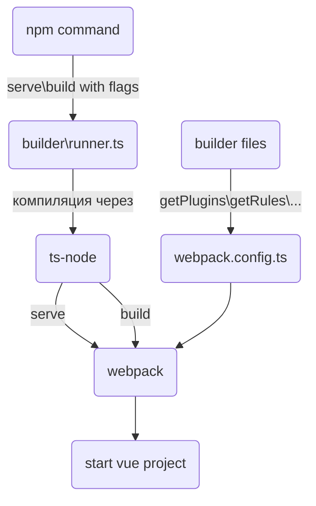

# Frontend boilerplate

Запуск проекта:
```
$ npm ci
$ npm run serve
```

## Аргументы запуска
аргумент | alias | default value | описание
---------|-------|---------------|---------
mode | m | production | опциональный параметр режима сборки `production` или `development`
analyze| a | false | параметр подключения `WebpackBundleAnalyzerPlugin`

## Используемые технологии:
- vue v3 (options-api)
- webpack v5
  - esbuild-loader v2
- typescript v4.7.3
- sass\scss v1.55
- eslint v8
- postcss v8
  - autoprefixer v10.4
  - pxtorem v6

---

## Структура выполнения проекта


---

## Структура проекта
- Папка [builder](#builder) - конфиг для webpack и сопутствующие модули
- Папка src - дефолтная папка для проекта

---

### Builder
Файлы:
- [webpack.config](webpack.config.ts) - результирующий конфиг для webpack
- [getDevServerConfig](builder/devServerConfig.ts) - конфигуратор для dev server
- [getPlugins](builder/plugins.ts) - конфигуратор для плагинов
- [getRules](builder/rules.ts) - конфигуратор для правил сборки

**Транспилятор**<br>
В качестве транспилятора ts и минификатора использован [esbuild](https://esbuild.github.io) (альтернатива babel и terser),
данное решение было принято ненадобностью поддерживать старые бразуеры (в которые esbuild не может транспилить)
и значительной скоростью сборки относительно babel.

**css и препроцессор**<br>
В качестве препроцессора использован sass\scss с утилитой postcss([конфиг](postcss.config.js)).<br>
В postcss настроено 2 плагина:
- [autoprefixer](https://github.com/postcss/autoprefixer) - плагин для добавление префиксов вендоров
- [pxtorem](https://github.com/cuth/postcss-pxtorem) - плагин для конвертирования `px` в `rem`. [дока](#pxtorem)
---
### Пакеты и особенности:

#### **pxtorem**
Плагин решает проблему разного масштабирования на девайсах.
При использовании системы `px`, то при выбранном масштабе экрана (dpr монитора) больше 100%,
страница изменяет увеличение элементов (т.е HTML страница помножается на масштаб экрана 100% * 150% = 1.5).
При использовании `rem` системы, мы устраняем проблему масштабирования экрана (масштаб экрана не участвует в расчёте),
но возможность изменить масштаб HTML страницы остаётся.
<br>Для игнорирования преобразования необходимо писать `PX` или `Px` вместо `px`.
<br>RootValue = 100 используется для, кратного деления px в rem, что бы в проде, можно было сразу понять сколько px на элементе (0.16rem = 16px).

## Guides and best practice

### Работа с универсальными компонентами
- [использование](#использование)
- [разработка](#разработка)

#### **Использование**
Базовые компоненты начинаются с суфикса `v`. Есть алиас для быстрого доступа `@ui/...`.

#### **Разработка**
Папка для создания `src/components/common`, инструкция:
- создать папку с названием вашего компонента в PascalCase
- создать файл с названием вашего компонента в PascalCase c префиксом `V`
(у некоторых компонентов префикс можно опустить)
- создать файл типов с названием `type.ts`
- создать файл `enums.ts` (если нужно) 
- создать файл `index.ts` и экспортировать все модули (компонент должен быть `export default`)
- создать файл README.md (если нужно) и описать там базовое использование компонента с пропсами и слотами
- 

Структура папки:
```
- VComponent - папка названия компонента
  - VComponent.vue - реализация компонента
  - types.ts - типы для компонента
  - enums.ts - енамы для компонента
  - index.ts - импорт компонента
```
```ts
// index.ts
import VComponent from './VComponent.vue';

export default VComponent;
export * from './types.ts';
```

Для того, что бы доступ стал одноуровневым:
```ts
import VComponent from '@ui/VComponent';
import type { VComponentProps } from '@ui/VComponent'
```
